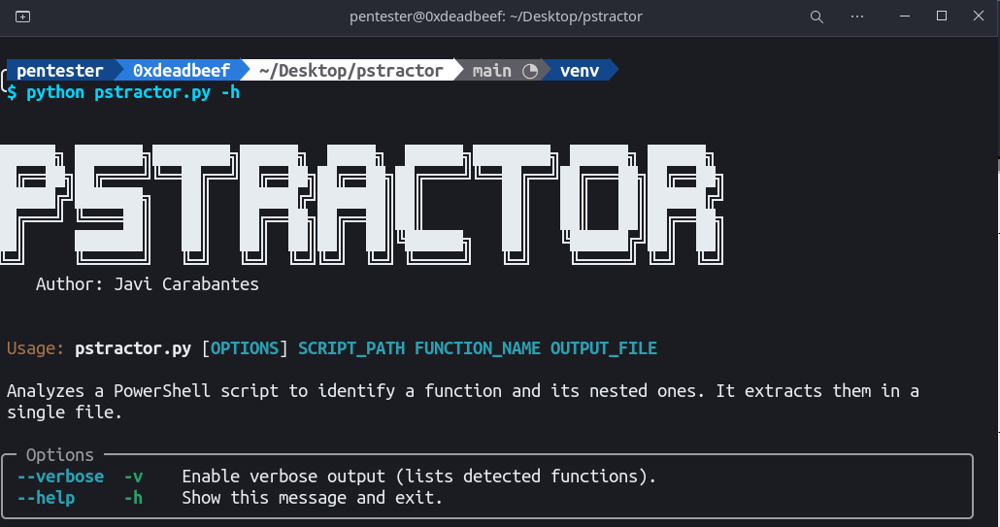
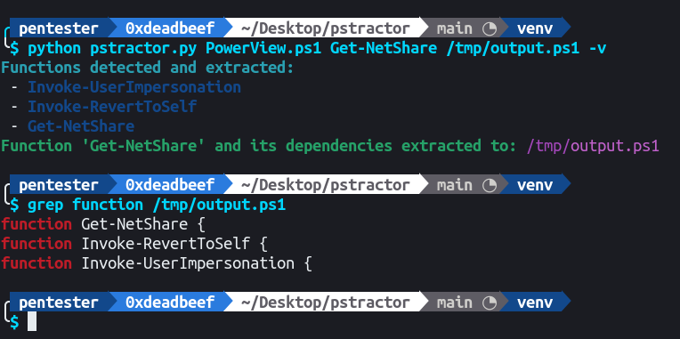

# Description


This Python script is designed to extract a specific PowerShell function, along with all its dependencies, from a PowerShell script. By removing comments and irrelevant lines, it helps you isolate and reuse functions while minimizing potential detection issues during engagements.

## Features

- **Extract PowerShell Functions:** Retrieve a specific function and all its dependent functions.
- **Comment Removal:** Automatically removes single-line (`#`) and multi-line (`<# ... #>`) comments.
- **Verbose Mode:** List all detected functions for transparency.
- **Output Management:** Save extracted functions to a specified file.

This tool is ideal for preparing PowerShell snippets for use in testing environments or engagements while ensuring minimal overhead.

## Installation

1. Clone the repository:
   ```bash
   git clone https://github.com/jcarabantes/pyPSTracer.git
   cd pyPSTracer
   ```

2. Create a virtual environment and install dependencies:
   ```bash
   python3 -m venv venv
   source venv/bin/activate  # For Windows: venv\Scripts\activate
   pip install -r requirements.txt
   ```

## Usage

Run the script with the following arguments:

```bash
python pystractor.py <path_to_script> <function_name> <output_file>
```

### Options

- **`-v / --verbose`:** Enables verbose output to list all functions detected during extraction.

### Example

#### Basic Extraction
To extract the `Get-NetShare` function and its dependencies from a PowerShell script:

```bash
python pystractor.py PowerView.ps1 Get-NetShare output.ps1
```

### Output
The extracted function(s) will be saved in the specified output file. If the file already exists, the new content will be appended.




## Known Issues

- The script assumes that all dependent functions are declared in the provided PowerShell script.
- Function detection relies on regex, which may occasionally produce false positives or miss edge cases.

## Roadmap

- Enhance regex for more robust function detection.
- Add support for recursive extraction.
